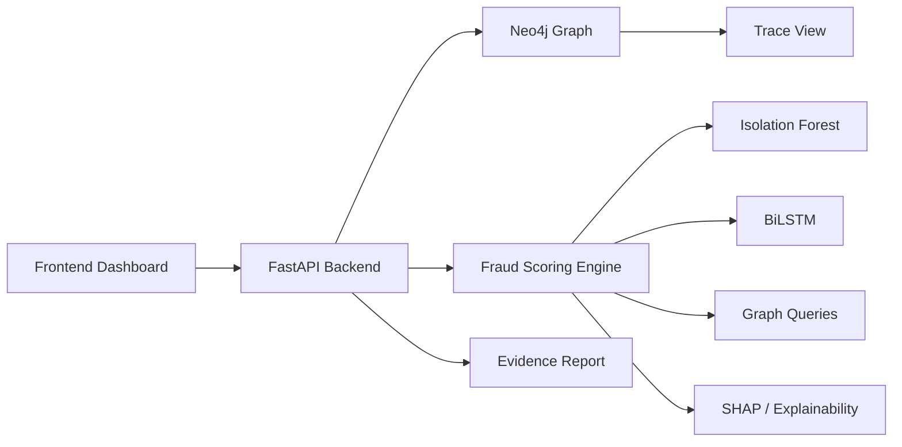

# TRACE-X

TRACE-X is a fraud detection platform for tracing the movement of funds across accounts and identifying suspicious behavior with a combination of graph analytics, machine learning, and explainability. The product is structured as a monorepo so the backend, AI/ML pipeline, and frontend can evolve together while still being deployable separately.

## What TRACE-X Does

TRACE-X is designed around the problem of tracking funds within a bank and producing evidence for investigators and FIU-style reporting. It focuses on the full fraud story rather than a single model score:

- detects rapid layering through multiple accounts
- detects circular or round-trip fund flows
- detects smurfing / structuring-like behavior
- detects dormant account activation with unusual transaction spikes
- detects KYC mismatch between customer profile and observed fund flow
- generates explainability output for risk review
- produces evidence packages that investigators can use directly

## Current Implementation Status

The following parts are implemented in this workspace:

- Synthetic data generation for accounts and transactions
- Neo4j graph loading for account nodes and transferred-fund relationships
- Two trained ML models:
  - Isolation Forest for dormant anomaly detection
  - BiLSTM for smurfing detection
- Explainability via SHAP for dormant scoring and SHAP-style / occlusion fallback for smurfing
- FastAPI backend with live ingest endpoints
- Fraud scoring endpoints for dashboard, trace, and report generation
- Shared Pydantic schema package for Python services
- Monorepo environment handling from the repository root

The frontend app is still a scaffold, but the backend is now ready for integration.

## Monorepo Layout

- `apps/api` - FastAPI backend
- `apps/ai-ml` - synthetic data, model training, graph loading, and fraud scoring logic
- `apps/frontend` - Next.js frontend scaffold
- `packages/py-schemas` - shared Python schemas used by API and AI/ML code

## High-Level Architecture



### Data Flow

1. Synthetic accounts and transactions are generated in CSV form.
2. The CSVs are loaded into Neo4j as account nodes and transfer relationships.
3. Models are trained locally and saved to disk.
4. The FastAPI backend loads the trained models and the graph data.
5. New accounts or transactions can be ingested through the API.
6. Fraud scores, traces, explanations, and evidence packages are returned immediately for frontend use.

## Features Implemented

### 1) Synthetic Data Generator

The generator creates realistic bank-style data for demo and training.

Implemented in:
- `apps/ai-ml/data/generate_data.py`

It produces:
- accounts with identity, KYC tier, risk category, declared income, and behavioral metrics
- transactions with sender, receiver, amount, timestamp, channel, status, and narration
- fraud labels for smurf masters and fraudulent accounts
- a smaller Neo4j-safe sample under `apps/ai-ml/data/neo4j`
- label files under `apps/ai-ml/data/labels`

Outputs include:
- `accounts.csv`
- `transactions.csv`
- `neo4j/accounts.csv`
- `neo4j/transactions.csv`
- `labels/smurf_accounts.csv`
- `labels/fraud_accounts.csv`

### 2) Neo4j Graph Loading

The graph loader reads the CSVs and writes them into Neo4j.

Implemented in:
- `apps/ai-ml/load_graph.py`

It supports:
- root `.env` loading
- Neo4j URI / user / password config
- account node upserts
- transfer relationship upserts
- optional graph clearing
- optional transaction capping for Aura Free safety
- loading from either the full dataset or the smaller Neo4j sample

Neo4j model:
- `Account` nodes
- transfer relationships between accounts with transaction metadata

### 3) Model Training

The training pipeline trains exactly two models.

Implemented in:
- `apps/ai-ml/train_models.py`

#### Model A: Isolation Forest
Used for dormant account anomaly detection.

Inputs:
- `dormancy_days`
- `txn_count_7d`
- `txn_count_30d`
- `volume_7d`
- `volume_30d`
- `avg_monthly_volume`
- `avg_monthly_count`
- `unique_counterparties_30d`

Saved artifacts:
- `apps/ai-ml/models/isolation_forest.pkl`
- `apps/ai-ml/models/scaler.pkl`

#### Model B: BiLSTM
Used for smurfing detection.

Inputs per timestep:
- normalized transaction amount
- time gap
- hour of day
- day of week
- UPI flag

Saved artifact:
- `apps/ai-ml/models/lstm_model.pt`

Additional training artifacts:
- `apps/ai-ml/models/acc_ids.npy`
- `apps/ai-ml/models/smurf_threshold.json`

Training improvements implemented:
- class balancing with weighted sampling
- threshold tuning for the smurfing classifier
- label ingestion from generated ground-truth files

### 4) Fraud Detector Engine

Implemented in:
- `apps/ai-ml/fraud_detector.py`

This module loads the models once and exposes all five detection paths.

#### `detect_layering(account_id)`
- Neo4j path query
- finds fund movement through 5+ accounts within 2 hours
- returns chain, amounts, timestamps, and hop count

#### `detect_roundtrip(account_id)`
- Neo4j cycle query
- finds circular money flows that return to the origin
- returns loop and amounts

#### `detect_smurfing(account_id)`
- loads `lstm_model.pt`
- uses the last 30 successful outgoing transactions
- returns probability and threshold

#### `detect_dormant(account_id)`
- loads `isolation_forest.pkl`
- scores account-level behavioral features
- returns anomaly confidence and supporting account stats

#### `detect_kyc_mismatch(account_id)`
- pure Python logic
- compares 30-day flow to declared monthly income
- flags CRITICAL / HIGH / MEDIUM / NORMAL by ratio

#### `score_account(account_id)`
- runs all detectors
- returns a combined fraud report
- used by the API and frontend dashboard

#### Explainability
- `explain_dormant(account_id)` returns SHAP-based feature contributions for dormant scoring
- `explain_smurfing(account_id)` returns SHAP-style explanations or occlusion fallback for the BiLSTM
- `build_evidence_package(account_id)` assembles a full investigator-ready package

### 5) FastAPI Backend

Implemented in:
- `apps/api/app/main.py`
- `apps/api/app/routers/fraud.py`
- `apps/api/app/routers/schema.py`
- `apps/api/app/routers/health.py`

The backend now supports:

#### Live ingest
- `POST /api/v1/accounts`
- `POST /api/v1/transactions`

These endpoints:
- write to Neo4j
- update local CSV cache used by the detectors
- recompute account metrics
- rescore impacted accounts
- return fraud results immediately

#### Fraud scoring and investigation
- `GET /api/v1/score/{account_id}`
- `GET /api/v1/alerts`
- `GET /api/v1/trace/{account_id}`
- `GET /api/v1/report/{account_id}`

#### Explainability
- `GET /api/v1/explain/dormant/{account_id}`
- `GET /api/v1/explain/smurfing/{account_id}`
- `GET /api/v1/explain/{account_id}`

#### Schema management
- `POST /api/v1/schema/setup`

#### Health
- `GET /api/v1/health`

### 6) Shared Schema Package

Implemented in:
- `packages/py-schemas`

This package defines shared Pydantic models used across the platform:
- `Account`
- `Transaction`
- `Alert`

The shared package keeps the backend and AI/ML code aligned on field names and makes the monorepo easier to maintain.

## Data Model

### Account

Main fields:
- `account_id`
- `entity_id`
- `account_type`
- `kyc_tier`
- `status`
- `opened_on`
- `risk_category`
- `declared_annual_income`
- `txn_count_7d`
- `txn_count_30d`
- `volume_7d`
- `volume_30d`
- `avg_monthly_volume`
- `avg_monthly_count`
- `unique_counterparties_30d`
- `last_active_ts`
- `dormancy_days`
- `is_fraud`
- `fraud_score`
- `last_scored_ts`

### Transaction

Main fields:
- `txn_id`
- `sender_id`
- `receiver_id`
- `amount`
- `channel`
- `txn_ts`
- `status`
- `narration`

### Alert

Main fields:
- `alert_id`
- `alert_ts`
- `model`
- `pattern`
- `fraud_prob`
- `tier`
- `total_amount`
- `hop_depth`
- `time_window_hrs`
- `status`

## Frontend Integration Points

The frontend can now be built around these stable backend responses:

### Dashboard
Use:
- `GET /api/v1/alerts`

For:
- flagged accounts list
- risk score
- reasons / detector outputs
- alert drill-down

### Account Detail View
Use:
- `GET /api/v1/score/{account_id}`

For:
- combined fraud risk
- detector-specific results
- explanation hooks

### Graph Visualization View
Use:
- `GET /api/v1/trace/{account_id}`

For:
- traced layering path
- chain of accounts
- amounts and timestamps

### Evidence / FIU Report View
Use:
- `GET /api/v1/report/{account_id}`

For:
- summary
- traces
- explanation payloads
- investigator-ready report bundle

### Explainability View
Use:
- `GET /api/v1/explain/{account_id}`
- `GET /api/v1/explain/dormant/{account_id}`
- `GET /api/v1/explain/smurfing/{account_id}`

For:
- model reasoning
- feature importance
- audit trail

### Live Demo Actions
Use:
- `POST /api/v1/accounts`
- `POST /api/v1/transactions`

For:
- creating a new demo account
- creating a new transaction
- showing the alert update immediately after ingest

## Environment Strategy

The repo now supports a root-level environment file.

Recommended files:
- `trace-x/.env` for shared settings
- `apps/api/.env` for API-only overrides if needed
- `apps/ai-ml/.env` for AI/ML-only overrides if needed

The platform loads the root env first and then local app env files as overrides.

Root env example:

```env
NEO4J_URI=neo4j+s://your-instance.databases.neo4j.io
NEO4J_USER=neo4j
NEO4J_PASSWORD=your_password
NEO4J_REL_TYPE=SENT
```

## Why Kafka Is Not Used Here

Kafka is not required for the current hackathon build.

Why:
- the demo is not a high-volume distributed streaming workload
- live ingest through the API is enough for an interactive demo
- Neo4j + FastAPI + ML gives the right story with less operational complexity

Kafka would make sense later if you wanted:
- production bank-event streaming
- multiple producers and consumers
- near-real-time event fanout at scale

For this hackathon, the simpler API-driven ingest is the better tradeoff.

## Demo Flow

A strong demo can follow this flow:

1. Show the alert dashboard.
2. Select a suspicious account.
3. Open the trace view and show the money path in Neo4j.
4. Open the explainability panel to show why it was flagged.
5. Create a new transaction from the UI.
6. Show the alert list update immediately.
7. Open the evidence report and export the investigator package.

## Running the Project

### 1) Generate synthetic data

```powershell
python apps/ai-ml/data/generate_data.py
```

This creates the full training set and a smaller Neo4j-safe subset.

### 2) Train the models

```powershell
python apps/ai-ml/train_models.py
```

### 3) Load graph data into Neo4j

Use the smaller sample for Aura Free:

```powershell
python apps/ai-ml/load_graph.py --data-dir apps/ai-ml/data/neo4j --clear
```

### 4) Run the backend

```powershell
cd apps/api
uvicorn app.main:app --reload
```

### 5) Run the frontend

```powershell
cd apps/frontend
npm install
npm run dev
```

Set the frontend API URL to the FastAPI backend, for example:

```env
NEXT_PUBLIC_API_URL=http://localhost:8000
```

## Notes on Neo4j Free Tier

Aura Free has a relationship cap, so the repo intentionally supports a smaller Neo4j export.

Recommended:
- train on the full synthetic dataset locally
- load the smaller `apps/ai-ml/data/neo4j` dataset into Aura Free

This keeps the demo stable while still letting the training set be large enough for useful models.

## Development Dependencies

### Python backend and AI/ML
- FastAPI
- Uvicorn
- Neo4j Python driver
- Pandas
- NumPy
- scikit-learn
- PyTorch
- SHAP
- python-dotenv
- joblib

### Frontend
- Next.js
- React
- TypeScript

## What To Build Next In The Frontend

Recommended pages/components:
- alert dashboard
- account detail drawer
- graph tracing page
- report generator page
- create account / create transaction demo controls
- evidence package export button

## Short Version

TRACE-X is now a full fraud-tracing backend with:
- graph-based tracing
- ML-based anomaly detection
- live ingest for demo interactions
- explainability for investigators
- evidence package generation
- frontend-ready API contracts

It is ready for a rich dashboard and demo flow.

## License

No license has been added yet.
