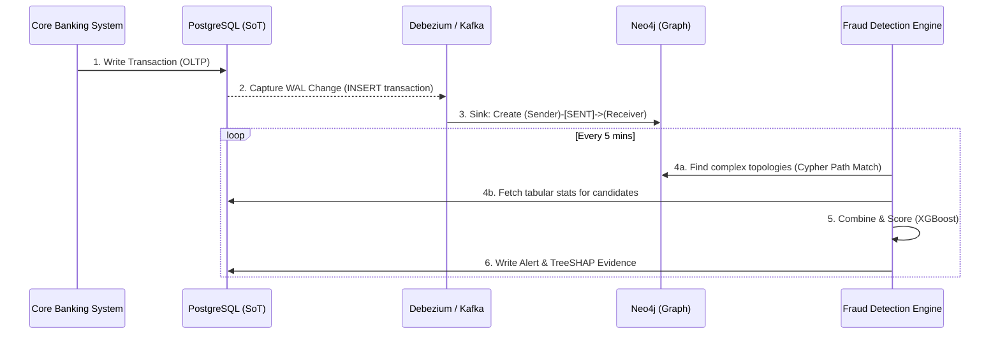

# TRACE-X Database Schema Architecture

This document defines the database schema and data flow architecture for the TRACE-X AML and fraud detection system. 

## 1. Architectural Philosophy: Polyglot Persistence

The system handles immense volumes of immutable transaction data alongside complex, multi-hop relationship queries. A single database technology cannot optimally serve both needs. Therefore, we use a **Polyglot Persistence** model:

*   **PostgreSQL**: The Relational Source of Truth. It is the system of record. It stores the immutable ledger, structured customer profiles, historical time-window aggregations, and the compliance case management system. 
*   **Neo4j**: The Topology Engine. It is a highly optimized, lightweight projection of the relational data. It is used **strictly** for topological pattern matching (paths, cycles, deep relationships, wash trading). We deliberately avoid storing heavy strings or rapidly changing state (like balances) in Neo4j to prevent write locks and degraded traversal performance.

---

## 2. PostgreSQL Schema (Relational Source of Truth)

PostgreSQL manages all state, transactions, and alert evidence.

### 2.1 Core Banking Entities

**Table: `entities`**
Represents the real-world person, company, or legal entity. Separating entities from accounts is crucial for detecting wash trading (moving money between different accounts owned by the same entity).

| Column | Type | Constraints / Indexes | Description |
| :--- | :--- | :--- | :--- |
| `entity_id` | `VARCHAR(50)` | **PRIMARY KEY** | Unique identifier (e.g., `ENT_8492`) |
| `entity_type` | `VARCHAR(20)` | `NOT NULL` | `INDIVIDUAL`, `BUSINESS`, `TRUST` |
| `entity_name` | `VARCHAR(255)` | `NOT NULL` | Full legal name |
| `pan_number` | `VARCHAR(20)` | **INDEX**, `UNIQUE` | Primary tax identifier |
| `registration_date`| `DATE` | `NOT NULL` | Date of incorporation / birth |
| `kyc_status` | `VARCHAR(20)` | `NOT NULL` | `PENDING`, `VERIFIED`, `REJECTED` |
| `pin_code` | `VARCHAR(10)` | | Geography tracking for ML features |

**Table: `accounts`**
The financial accounts owned by entities.

| Column | Type | Constraints / Indexes | Description |
| :--- | :--- | :--- | :--- |
| `account_id` | `VARCHAR(50)` | **PRIMARY KEY** | Unique account ID |
| `entity_id` | `VARCHAR(50)` | **FOREIGN KEY**, **INDEX**| Link to `entities` |
| `account_type` | `VARCHAR(20)` | `NOT NULL` | `SAVINGS`, `CURRENT`, `SALARY` |
| `kyc_tier` | `INTEGER` | `NOT NULL` | `0` (Student) to `3` (HNI/Corporate) |
| `status` | `VARCHAR(20)` | `NOT NULL` | `ACTIVE`, `DORMANT`, `FROZEN` |
| `opened_on` | `TIMESTAMP` | `NOT NULL` | Account creation date |
| `declared_income` | `DECIMAL(18,2)` | | Declared annual income during KYC |
| `branch_code` | `VARCHAR(20)` | **INDEX** | Routing code |
| `current_balance` | `DECIMAL(18,2)` | `NOT NULL` | Latest balance |

**Table: `devices` (Digital Footprint)**
Tracks how accounts are accessed. Shared devices/IPs across multiple unlinked accounts are strong indicators of money mules or smurfing rings.

| Column | Type | Constraints / Indexes | Description |
| :--- | :--- | :--- | :--- |
| `session_id` | `VARCHAR(100)` | **PRIMARY KEY** | Session token / ID |
| `account_id` | `VARCHAR(50)` | **FOREIGN KEY**, **INDEX**| Link to `accounts` |
| `device_hash` | `VARCHAR(255)` | **INDEX** | Device fingerprint / IMEI |
| `ip_address` | `INET` | **INDEX** | Network origin |
| `login_ts` | `TIMESTAMP` | `NOT NULL` | Time of access |

---

### 2.2 The Ledger

**Table: `transactions`**
The raw, immutable ledger of all fund flows. Note: `receiver_id` may point to an external bank, so it is not a strict foreign key constraint to our internal `accounts` table.

| Column | Type | Constraints / Indexes | Description |
| :--- | :--- | :--- | :--- |
| `txn_id` | `VARCHAR(50)` | **PRIMARY KEY** | Unique transaction ID |
| `sender_id` | `VARCHAR(50)` | **INDEX** | Originating account ID |
| `receiver_id` | `VARCHAR(50)` | **INDEX** | Destination account ID |
| `amount` | `DECIMAL(18,2)` | `NOT NULL` | Transaction value |
| `channel` | `VARCHAR(20)` | `NOT NULL` | `UPI`, `NEFT`, `RTGS`, `IMPS` |
| `txn_ts` | `TIMESTAMP` | **INDEX** | Execution timestamp |
| `status` | `VARCHAR(20)` | `NOT NULL` | `SUCCESS`, `FAILED`, `PENDING` |
| `narration` | `TEXT` | | User-provided description |

---

### 2.3 Pre-computed Machine Learning Stats

**Table: `account_stats`**
To ensure real-time ML inference (< 50ms), we avoid massive `GROUP BY` operations on the ledger. Instead, streaming jobs (or async triggers) update these rolling statistics.

| Column | Type | Constraints | Description |
| :--- | :--- | :--- | :--- |
| `account_id` | `VARCHAR(50)` | **PRIMARY KEY**, **FK** | Link to `accounts` |
| `txn_count_7d` | `INTEGER` | | Outgoing transactions in last 7 days |
| `volume_7d` | `DECIMAL(18,2)` | | Total outgoing volume in last 7 days |
| `avg_monthly_volume`| `DECIMAL(18,2)` | | Lifetime average volume |
| `unique_recipients` | `INTEGER` | | Unique counterparties in last 30 days |
| `last_active_ts` | `TIMESTAMP` | | Crucial for dormancy detection |
| `updated_at` | `TIMESTAMP` | | Last recalculation time |

---

### 2.4 Case Management & Compliance

**Table: `alerts`**
Generated by the ML pipelines when an account crosses a risk threshold.

| Column | Type | Constraints / Indexes | Description |
| :--- | :--- | :--- | :--- |
| `alert_id` | `VARCHAR(50)` | **PRIMARY KEY** | Unique alert ID |
| `account_id` | `VARCHAR(50)` | **FOREIGN KEY**, **INDEX**| Account flagged |
| `pattern_type` | `VARCHAR(50)` | `NOT NULL` | e.g., `SMURFING`, `LAYERING` |
| `fraud_probability` | `DECIMAL(5,4)` | `NOT NULL` | ML confidence score (0.0 to 1.0) |
| `severity` | `VARCHAR(20)` | `NOT NULL` | `CRITICAL`, `HIGH`, `MEDIUM` |
| `status` | `VARCHAR(20)` | `NOT NULL` | `OPEN`, `INVESTIGATING`, `CLOSED` |
| `created_at` | `TIMESTAMP` | `NOT NULL` | Alert generation time |

**Table: `alert_evidence`**
A snapshot of the data exactly as the ML model saw it. This guarantees explainability (TreeSHAP) does not suffer from data drift.

| Column | Type | Constraints | Description |
| :--- | :--- | :--- | :--- |
| `alert_id` | `VARCHAR(50)` | **PRIMARY KEY**, **FK** | Link to `alerts` |
| `shap_values` | `JSONB` | | Feature importance dict |
| `triggering_txns` | `JSONB` | | Array of `txn_id`s forming the pattern |
| `snapshot_data` | `JSONB` | | Values of ML features at time of execution |

---

## 3. Neo4j Schema (Graph Topology)

The graph database is intentionally kept sparse. It **only** stores what is necessary to trace multi-hop money flows efficiently.

### 3.1 Nodes

**Label: `Account`**

| Property | Type | Indexes | Description |
| :--- | :--- | :--- | :--- |
| `account_id` | `String` | **UNIQUE INDEX** | Primary identifier |
| `entity_id` | `String` | **INDEX** | Allows catching A -> B -> C -> A where A and C belong to the same entity |
| `kyc_tier` | `Integer` | | Used to quickly prune traversals if looking for specific account profiles |

> ⚠️ **Design Constraint:** We **do not** store volatile metrics like `balance` or `txn_count_7d` on the node. Rapid node updates cause heavy locking in Neo4j and degrade query performance. 

### 3.2 Relationships

**Type: `SENT`**
A directional edge representing a successful transfer from a source `Account` to a destination `Account`.

| Property | Type | Indexes | Description |
| :--- | :--- | :--- | :--- |
| `txn_id` | `String` | | Matches PostgreSQL ledger |
| `amount` | `Float` | **RELATIONSHIP INDEX** | Crucial for rapid pruning: `WHERE amount > 50000` |
| `txn_ts` | `Datetime` | **RELATIONSHIP INDEX** | Crucial for time-window limits in hops |

> 🚀 **Performance Tuning:** Neo4j 4.3+ supports indexing relationship properties. By indexing `(SENT, amount)` and `(SENT, txn_ts)`, queries for Layering and Round-Tripping skip scanning irrelevant, low-value edges entirely.

---

## 4. Synchronization Strategy (CDC Pipeline)

To maintain this polyglot architecture without data inconsistencies, we use a Change Data Capture (CDC) pipeline.

### The Read/Write Lifecycle
1. **Writes**: Core Banking writes raw transactions and KYC updates directly to PostgreSQL.
2. **Replication**: Debezium reads the PostgreSQL Write-Ahead Log (WAL) and publishes changes to Kafka.
3. **Graph Sync**: A Kafka sink connector ingests these changes into Neo4j, creating or updating `Account` nodes and `SENT` relationships.
4. **Inference**: The ML models execute hybrid queries. They pull topology features from Neo4j (e.g., *Is there a 4-hop chain?*) and state features from PostgreSQL (e.g., *What is the 30-day volume?*).
5. **Alerts**: Determinations are written back to PostgreSQL (`alerts`). The UI reads exclusively from PostgreSQL unless an investigator specifically requests a real-time graph visualization.
