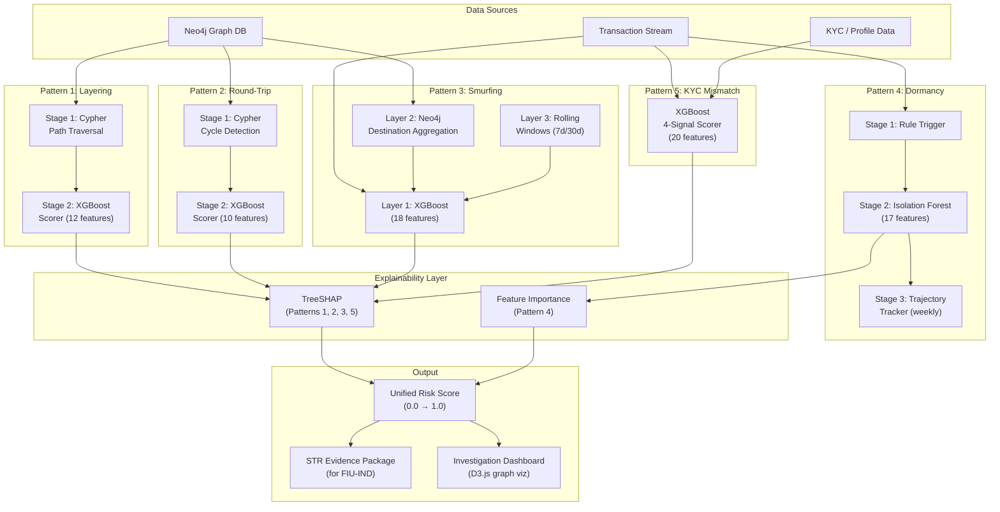

# TRACE-X — Model Selection & Architecture Document

## Table of Contents
1. [Problem Context](#problem-context)
2. [Architecture Summary](#architecture-summary)
3. [Pattern 1: Rapid Layering](#pattern-1-rapid-layering)
4. [Pattern 2: Circular Transactions (Round-Tripping)](#pattern-2-circular-transactions-round-tripping)
5. [Pattern 3: Structuring Below Thresholds (Smurfing)](#pattern-3-structuring-below-thresholds-smurfing)
6. [Pattern 4: Sudden Activation of Dormant Accounts](#pattern-4-sudden-activation-of-dormant-accounts)
7. [Pattern 5: Customer Profile vs Behaviour Mismatch](#pattern-5-customer-profile-vs-behaviour-mismatch)
8. [Consolidated Comparison](#consolidated-comparison)
9. [Complete Model Inventory](#complete-model-inventory)
10. [Implementation Priority](#implementation-priority)
11. [Future Roadmap](#future-roadmap)

---

## Problem Context

TRACE-X addresses **PS03: Tracking of Funds within Bank for Fraud Detection** for the iDEA 2.0 hackathon by Union Bank of India.

The system must detect **5 specific fraud patterns** defined in the problem statement:

| # | Pattern | What It Is | Real-World Example |
|---|---|---|---|
| 1 | Rapid Layering | Money hops through many accounts quickly to obscure its origin | ₹50L moves A→B→C→D in 10 minutes |
| 2 | Round-Tripping | Money leaves an account, travels through others, and returns | A→B→C→A to inflate volume or wash funds |
| 3 | Smurfing | Large amounts split into many small transfers below the ₹10L reporting threshold | ₹60L split into 7 transfers of ~₹8.5L each |
| 4 | Dormant Activation | An inactive account suddenly handles large transfers | 2-year dormant account receives ₹1Cr and forwards it immediately |
| 5 | Profile Mismatch | Transaction behaviour contradicts the customer's declared KYC profile | A "student" account handling ₹80L in corporate wire transfers |

Each pattern has a fundamentally different mathematical structure, which is why **different models are used for different patterns** — no single model can optimally detect all five.

### Key Architectural Principle

> **Different problems need different tools.** Patterns 1 & 2 are graph topology problems (best solved with graph queries). Pattern 3 is a tabular classification problem (best solved with gradient boosting). Pattern 4 is an anomaly detection problem (best solved with unsupervised methods). Pattern 5 is a cross-domain comparison problem (best solved with supervised classification on mixed features).

---

## Architecture Summary



---

## Pattern 1: Rapid Layering

### What Is Rapid Layering?

Money enters Account A and immediately moves to B, then C, then D — all within minutes or hours. Each "hop" makes the original source harder to trace. This is the most common technique in the **layering** phase of money laundering (the second step of Placement → Layering → Integration).

```
₹50L → Acc A → Acc B → Acc C → Acc D → Cash Out
         ↑ each hop within 2-10 minutes
```

### What Makes It Difficult to Detect?

The core challenge is **distinguishing layering from legitimate multi-hop transactions**. In a real banking system:
- Supply chain payments naturally create chains: Company A pays Supplier B, B pays Sub-supplier C, C pays Raw Material Provider D
- Salary routing creates chains: Company → Payroll Provider → Employee Bank
- Inter-branch transfers create chains between the same customer's accounts

A naive detector that flags "any chain of 3+ transactions" would drown investigators in false positives.

### What the Current Implementation Does

Currently, [fraud_detector.py L401-411](file:///c:/Nirmal/Projects/trace-x-ideahack/apps/ai-ml/fraud_detector.py#L401-L411) uses a pure Cypher query:
```cypher
MATCH path = (start)-[:SENT*2..8]->(end)
WHERE start <> end
-- No time constraint, no amount constraint
```

**Problem:** This finds ANY path where money moved through 3+ accounts — including completely legitimate transactions days or weeks apart with unrelated amounts. The confidence is hardcoded to `0.92` regardless of the actual suspiciousness.

### All Candidate Models Considered

#### Option A: Pure Neo4j Cypher (Currently Implemented)

**How it works:** You write a Cypher query that pattern-matches against the graph structure. "Find all paths from A to D that are 3-6 hops long."

| Pros | Cons |
|---|---|
| ✅ 100% precision for defined patterns — a path either exists or it doesn't | ❌ Without time and amount constraints, it flags everything — massive false positives |
| ✅ Deterministic — no training data needed, no model to maintain | ❌ Only catches patterns you explicitly write queries for |
| ✅ Blazing fast on indexed graph data | ❌ Cannot learn contextual signals (is this account normally a pass-through? is this a new relationship?) |
| ✅ Perfectly explainable to compliance officers | ❌ Hardcoded confidence scores are meaningless |

**Verdict:** Cypher is the right tool for *finding structural candidates*, but it cannot *score* how suspicious they are. It should be Stage 1, not the entire pipeline.

#### Option B: Graph Neural Network (GNN / GraphSAGE)

**How it works:** A neural network that learns vector representations (embeddings) for each account by aggregating information from its neighbors in the graph. It can then classify accounts or subgraphs as fraudulent or legitimate.

| Pros | Cons |
|---|---|
| ✅ Learns complex topologies from data — can discover fraud patterns you didn't anticipate | ❌ Requires a large, labeled graph dataset (millions of nodes) to train effectively — our data has ~1000 accounts |
| ✅ Captures neighborhood context — "B is suspicious because B's neighbors are suspicious" | ❌ Terrible explainability — "the embedding was anomalous" doesn't satisfy compliance requirements |
| ✅ Academically prestigious — research papers show near-perfect detection on labeled datasets | ❌ Complex implementation (PyTorch Geometric, custom data loaders, mini-batch sampling) — 3-5 days minimum |
| | ❌ Slow inference (~50-200ms per account vs ~1ms for XGBoost) |

**Verdict:** GNN is a powerful future enhancement for discovering unknown patterns, but it's wrong for our hackathon: not enough data, terrible explainability, too complex to implement reliably in 6 days.

#### Option C: XGBoost with Graph-Derived Features

**How it works:** Extract numerical features from each candidate chain (hop count, time between hops, amount preservation ratio, account ages) and feed them to an XGBoost classifier that outputs a fraud probability.

| Pros | Cons |
|---|---|
| ✅ Extremely fast inference (~1ms) | ❌ Requires manual feature engineering — you need to know which features matter |
| ✅ Handles class imbalance natively (via `scale_pos_weight`) | ❌ Cannot discover entirely new graph patterns on its own (unlike GNN) |
| ✅ Perfect integration with TreeSHAP for compliance-grade explainability | |
| ✅ Works well on small datasets | |
| ✅ Academically validated — XGBoost consistently dominates fraud detection benchmarks | |

**Verdict:** XGBoost is the best scoring model for our use case, but it needs candidates to score — it can't find graph structures on its own.

#### Option D: Neo4j GDS Algorithms (Weakly Connected Components, Community Detection)

**How it works:** Neo4j's Graph Data Science library runs statistical algorithms directly on the graph to find clusters, hubs, and connected components.

| Pros | Cons |
|---|---|
| ✅ Finds connected subgraphs automatically — no explicit pattern needed | ❌ Produces clusters, not explicit layering paths — needs post-processing |
| ✅ No training data required | ❌ Higher false positive rate without time/amount filtering |
| ✅ Can discover chains you didn't explicitly code for | ❌ Doesn't score individual chains — just groups accounts |

**Verdict:** Useful as a supplementary discovery tool, but not sufficient as a primary detector.

### ✅ Recommended Architecture: Cypher (Stage 1) → XGBoost (Stage 2) + TreeSHAP

**Why this combination is the best:**
- **Cypher** handles what it's good at: finding the structural shape (multi-hop chains) with basic guard-rails (time window, minimum amount)
- **XGBoost** handles what Cypher can't: scoring how suspicious that shape actually is based on contextual features (account ages, relationship history, amount preservation)
- **TreeSHAP** provides the compliance-grade explainability required for STR filing

**Why nothing else is better:**
- Pure Cypher (Option A) misses context → too many false positives
- GNN (Option B) is the right direction for the future, but impractical now (data size, explainability, implementation time)
- XGBoost alone (Option C) can't find graph structures — it needs Cypher to feed it candidates
- Neo4j GDS (Option D) finds groups, not individual suspicious chains

#### Stage 1 — Cypher Candidate Extraction

The Cypher query finds paths with basic time and amount constraints to eliminate obvious non-fraud:

```cypher
MATCH path = (start:Account)-[r:SENT*3..6]->(end:Account)
WHERE start <> end
  -- Time guard: all hops must occur within 2 hours of each other
  AND ALL(i IN range(0, size(r)-2)
      WHERE duration.between(r[i].txn_ts, r[i+1].txn_ts).minutes < 120)
  -- Amount guard: each hop must involve at least ₹50,000
  AND ALL(rel IN r WHERE toFloat(rel.amount) > 50000)
RETURN [n IN nodes(path) | n.account_id] AS chain,
       [rel IN relationships(path) | toFloat(rel.amount)] AS amounts,
       [rel IN relationships(path) | rel.txn_ts] AS timestamps
```

**What the guards do:**
- `duration < 120 minutes`: Eliminates chains where hops are days/weeks apart (normal business)
- `amount > 50000`: Eliminates tiny everyday transactions (₹300 groceries)

#### Stage 2 — XGBoost Scorer

For each candidate chain that survives Stage 1, extract these features and let XGBoost score it:

```python
LAYERING_FEATURES = [
    'hop_count',                     # Number of accounts in chain (more hops = more suspicious)
    'total_chain_time_minutes',      # Total time from first to last hop (shorter = more suspicious)
    'avg_time_between_hops_min',     # Average gap between transfers (very low = robotic speed)
    'amount_preservation_ratio',     # min(amounts) / max(amounts) — near 1.0 means money is just
                                     # passing through without being "used" (highly suspicious)
    'amount_std_dev',                # Low variance across hops = artificially consistent amounts
    'avg_account_age_days',          # Young accounts in chain = possible shell accounts
    'min_account_age_days',          # Youngest account — if created last week, red flag
    'avg_prior_tx_count',            # Low prior activity = accounts created just for this purpose
    'new_relationship_pct',          # % of edges that are first-time transfers between these accounts
    'passthrough_ratio',             # Does B immediately forward what it receives? (mule behaviour)
    'dormant_in_chain',              # Any dormant account reactivated in this chain?
    'end_account_cash_out',          # Did the final account withdraw cash? (integration step)
]
```

**The most important feature — `amount_preservation_ratio`:**
This is what separates real layering from normal chains. In legitimate transactions, B *uses* some of the money it received (pays for services, buys goods). In layering, B just passes the money through, keeping nearly the full amount intact:
- A sends ₹50L → B sends ₹48L to C → ratio = 0.96 → **SUSPICIOUS** (money just passing through)
- A sends ₹300 → B sends ₹100 to C → ratio = 0.33 → **NORMAL** (B used ₹200 for something else)

#### Edge Case Analysis

| Scenario | What Happens | Correct? |
|---|---|---|
| A→₹300→B→₹300→C over 2 weeks | Filtered by Cypher Stage 1 (time gap > 120 min between hops) | ✅ Correctly ignored |
| A→₹300→B→₹100→C within 10 min | Passes Cypher but XGBoost scores low (preservation ratio = 0.33) | ✅ Correctly scored low |
| A→₹50L→B→₹48L→C→₹47L→D within 10 min | Passes Cypher, XGBoost scores high (0.94 preservation, 10 min speed, possibly new accounts) | ✅ Correctly flagged |
| Supply chain: Company→Supplier→Sub-supplier (₹10L each, over 3 days) | Filtered by Cypher (3 days > 120 min) | ✅ Correctly ignored |

---

## Pattern 2: Circular Transactions (Round-Tripping)

### What Is Round-Tripping?

Money leaves Account A, travels through B and C, and returns to A. This artificially inflates transaction volume (making a business look more active) or launders money by making it appear as "earned income" when it's actually the same money circling back.

```
Acc A → ₹50L → Acc B → ₹48L → Acc C → ₹47L → Acc A
↑ Looks like A "earned" ₹47L from a business transaction
```

### What Makes It Difficult to Detect?

In a real economy, cycles happen naturally:
- A pays B (contractor), B buys from C (vendor), C pays A for a separate service — over 3 months
- Mutual fund flows: Investor → Fund → Company → Investor (as dividends)

The detector needs to distinguish **artificial circles** (same money intentionally routed back quickly) from **organic economic cycles** (different transactions that happen to form a loop over time).

### What the Current Implementation Does

Currently, [fraud_detector.py L486-493](file:///c:/Nirmal/Projects/trace-x-ideahack/apps/ai-ml/fraud_detector.py#L486-L493) uses:
```cypher
MATCH path = (a)-[:SENT*2..6]->(a)
-- No chronological ordering, no time window
```

**Problem:** Same as Pattern 1 — finds ALL cycles including normal business relationships. Confidence hardcoded to `0.89`.

### All Candidate Models Considered

| Model | Best For | Why Not Chosen (if not recommended) |
|---|---|---|
| **Neo4j Cypher Cycle Detection** | Finding exact cycles where start = end | Cannot score suspiciousness — only finds structure |
| **Neo4j GDS — Strongly Connected Components (SCC)** | Finding ALL nodes that can reach each other bidirectionally | Finds structural connectivity, not necessarily money flow cycles — needs heavy post-filtering |
| **Neo4j GDS — Louvain Community Detection** | Grouping tightly connected accounts into communities | Finds clusters, not explicit cycles — higher false positive rate |
| **GNN** | Learning cycle-like motifs from labeled data | Massive overkill for cycle detection — Neo4j already solves this directly |
| **XGBoost (on cycle features)** | Scoring how suspicious a discovered cycle is | Cannot find cycles on its own — needs Cypher to feed candidates |

### ✅ Recommended Architecture: Cypher (Stage 1) → XGBoost (Stage 2) + TreeSHAP

Same hybrid logic as Pattern 1. Cypher finds the structural cycles, XGBoost scores how suspicious they are.

#### Stage 1 — Cypher Cycle Detection

```cypher
MATCH path = (a:Account)-[r:SENT*3..5]->(a)
WHERE
  -- Chronological: each hop must occur after the previous one
  ALL(i IN range(0, size(r)-2) WHERE r[i+1].txn_ts > r[i].txn_ts)
  -- Time window: entire cycle completes within 48 hours
  AND duration.between(r[0].txn_ts, r[size(r)-1].txn_ts).hours < 48
  -- Minimum amount: each hop involves at least ₹50,000
  AND ALL(rel IN r WHERE toFloat(rel.amount) > 50000)
RETURN [n IN nodes(path) | n.account_id] AS loop,
       [rel IN relationships(path) | toFloat(rel.amount)] AS amounts,
       [rel IN relationships(path) | rel.txn_ts] AS timestamps
```

#### Stage 2 — XGBoost Scorer (10 features)

```python
ROUNDTRIP_FEATURES = [
    'cycle_length',                  # Number of hops in the loop (3-5)
    'total_cycle_time_hours',        # Time to complete the full circle
    'avg_hop_time_minutes',          # Average gap between hops
    'return_amount_ratio',           # amount_returned_to_A / amount_sent_by_A — near 1.0 = wash
    'amount_std_across_hops',        # Low variance = artificially consistent
    'prior_cycle_count',             # Has this exact ring done this before? Repeat = red flag
    'accounts_avg_age_days',         # Young accounts = coordinated setup
    'accounts_shared_kyc_tier',      # All same KYC tier = likely coordinated
    'min_prior_tx_between_pairs',    # First-time relationships in the cycle?
    'end_cash_out_within_24h',       # Cash withdrawal after cycle completes = integration
]
```

**The most important feature — `return_amount_ratio`:**
- A sends ₹50L, receives back ₹47L → ratio = 0.94 → **SUSPICIOUS** (money came back nearly intact)
- A sends ₹500 to B, months later C pays A ₹100 for a service → ratio = 0.20 → **NORMAL**

---

## Pattern 3: Structuring Below Thresholds (Smurfing)

### What Is Smurfing?

In India, transactions above ₹10 Lakh trigger mandatory reporting to FIU-IND. Fraudsters exploit this by splitting large sums into multiple smaller transactions, each below the threshold:

```
Instead of: ₹60L (one transaction → triggers reporting)
Fraudster does: ₹9.5L + ₹9.2L + ₹9.8L + ₹9.7L + ₹9.9L + ₹9.8L = ₹58L (6 transactions, none reported)
```

### What Makes It Difficult to Detect?

Smurfing is hard because many legitimate businesses naturally make multiple large transactions below ₹10L:
- A vegetable wholesaler sending ₹8.5L to 6 different suppliers daily
- A small company paying ₹7-9L salaries to 20 employees on the 1st of every month
- A wedding planner making multiple venue/catering/decoration payments

Additionally, sophisticated fraudsters adapt:
- They use **multiple source accounts** (10 accounts each send ONE ₹9L transaction — no single account looks suspicious)
- They **spread across multiple days** (₹9.5L per day for 6 days avoids any 24-hour window detection)
- They use **amounts far below ₹10L** (₹4-6L instead of ₹9L) to avoid threshold-proximity detection

### What the Current Implementation Does

Currently uses a **PyTorch BiLSTM** ([fraud_detector.py L85-103](file:///c:/Nirmal/Projects/trace-x-ideahack/apps/ai-ml/fraud_detector.py#L85-L103)) with only 5 features: `amount`, `gap_min`, `hour`, `day`, `is_upi`.

**Problems:**
- Achieves only **0.67 AUC-ROC** — barely better than a coin flip (0.50 = random)
- Training labels are generated by the same heuristic rules the model then "learns" → **circular validation** (the model memorizes the generator script, not real patterns)
- Uses slow **KernelSHAP** with occlusion fallback for explainability (seconds per explanation)
- BiLSTM is architecturally overkill for a 30-step sequence with 5 features

### All Candidate Models Considered

#### Option A: XGBoost (Gradient Boosted Decision Trees) ← RECOMMENDED

**How it works:** Takes a row of engineered features (transaction count in 24h, amount variance, threshold proximity, etc.) and outputs a fraud probability. Each decision tree in the ensemble learns to correct the errors of the previous one.

| Pros | Cons |
|---|---|
| ✅ Dominates tabular classification benchmarks — consistently achieves 0.92-0.99+ AUC on fraud datasets | ❌ Requires manual feature engineering (you must design the right features) |
| ✅ Handles class imbalance natively via `scale_pos_weight` parameter | ❌ Cannot capture sequential dependencies natively (mitigated by engineered window features) |
| ✅ Extremely fast inference (~1ms per prediction) — critical for real-time banking | ❌ Only looks at one account at a time (mitigated by adding Neo4j aggregation as Layer 2) |
| ✅ Perfect integration with TreeSHAP — exact feature attributions in milliseconds | |
| ✅ Works well on small datasets (even hundreds of training samples) | |
| ✅ Academically validated: "XGBoost outperforms all models with 99.91% accuracy" on PaySim benchmark | |

#### Option B: BiLSTM (Bidirectional Long Short-Term Memory) — Currently Implemented

**How it works:** A recurrent neural network that processes the sequence of transactions in chronological order (and reverse), learning temporal dependencies between consecutive transactions.

| Pros | Cons |
|---|---|
| ✅ Theoretically captures sequential patterns ("this transaction came right after that one") | ❌ **Currently achieving only 0.67 AUC-ROC** — empirically failing on our data |
| ✅ Good when you have long sequences (hundreds of transactions per account) | ❌ Overkill for a 30-transaction window with 5 features — like using a jet engine for a bicycle |
| | ❌ Slow inference (~100x slower than XGBoost) |
| | ❌ Hard to explain — requires slow KernelSHAP (seconds per explanation vs milliseconds for TreeSHAP) |
| | ❌ Training is unstable on small/synthetic datasets — prone to overfitting |

#### Option C: LightGBM

**How it works:** Very similar to XGBoost — gradient boosted decision trees with a slightly different splitting algorithm (leaf-wise vs level-wise).

| Pros | Cons |
|---|---|
| ✅ Often slightly faster training time than XGBoost | ❌ Marginally less accurate than XGBoost in most fraud benchmarks |
| ✅ Also supports TreeSHAP | ❌ Less community support for fraud-specific tuning |

**Verdict:** Very close to XGBoost. Either would work, but XGBoost has more fraud-specific research backing.

#### Option D: Random Forest

| Pros | Cons |
|---|---|
| ✅ Simple to implement, reasonably accurate | ❌ Slower inference than XGBoost |
| ✅ Supports TreeSHAP | ❌ Typically 2-5% lower accuracy on imbalanced fraud data |
| | ❌ Doesn't handle class imbalance as elegantly |

#### Option E: Autoencoder (Unsupervised Deep Learning)

**How it works:** Learns to compress and reconstruct "normal" transaction patterns. High reconstruction error = anomalous.

| Pros | Cons |
|---|---|
| ✅ No labeled data needed | ❌ High false positive rate — can't distinguish smurfing from legitimate high-frequency business |
| ✅ Learns complex "normal" patterns | ❌ Poor explainability — "reconstruction error was high" doesn't satisfy compliance |

#### Option F: Rule-Based Threshold Check

**How it works:** Simple: "flag if 3+ transactions between ₹8L-₹10L within 24 hours."

| Pros | Cons |
|---|---|
| ✅ 100% explainable, trivial to implement | ❌ Trivially easy for fraudsters to evade (just use ₹5L instead of ₹9L) |
| | ❌ Misses sophisticated structuring entirely |
| | ❌ Massive false positives during salary season or festival spending |

### ✅ Recommended Architecture: 3-Layer Pipeline

**Why 3 layers:** Single-account XGBoost (Layer 1) catches naive smurfs. But it's **blind to coordinated smurfing** across multiple accounts sending to the same destination. And it **misses slow structuring** spread across multiple days. Layers 2 and 3 fix these blind spots.

#### Layer 1 — XGBoost (Single Account Detection)

Catches smurfs operating through a single account.

```python
SMURFING_FEATURES = [
    # ── Core transaction features ──
    'amount',                        # Transaction amount
    'tx_count_last_24h',             # Number of outgoing txns in 24 hours
    'total_volume_24h',              # Cumulative amount sent in 24 hours
    'channel_upi_ratio',             # % of txns via UPI (smurfers prefer UPI for speed)

    # ── Multi-day rolling windows (catches slow structuring) ──
    'tx_count_last_7d',              # Extends detection beyond 24h window
    'tx_count_last_30d',             # Monthly frequency
    'total_volume_7d',               # Weekly cumulative volume
    'total_volume_30d',              # Monthly cumulative volume
    'near_threshold_count_30d',      # How many txns between ₹8-10L in the past month?

    # ── Amount distribution signals ──
    'amount_variance_24h',           # Low variance = suspiciously uniform amounts
    'amount_clustering_score',       # Are amounts clustered near ANY threshold? (not just ₹10L)
    'threshold_avoidance_ratio',     # % of txns between 70%-99% of reporting threshold

    # ── Timing signals ──
    'time_gap_mean_min',             # Average minutes between consecutive txns
    'time_gap_stddev',               # Low std dev = robotic regularity (humans are irregular)
    'is_weekend',                    # Weekend business activity for a salaried account = unusual

    # ── Account context ──
    'unique_recipients_24h',         # Many different recipients = spreading money
    'account_age_days',              # New accounts are riskier
    'orig_balance_after_ratio',      # Balance depletion — did the account empty itself?
]
```

**Key innovation — `amount_clustering_score`:** Instead of only checking "is the amount near ₹10L?", this feature detects clustering at ANY amount level. If a fraudster learns our ₹10L detection and switches to ₹5L transactions, this feature still catches the unnatural clustering pattern.

#### Layer 2 — Neo4j Aggregation (Multi-Account Coordination)

Catches coordinated smurfing — multiple source accounts sending sub-threshold amounts to the same destination.

```cypher
-- Find destinations receiving many sub-threshold amounts from different sources
MATCH (src:Account)-[r:SENT]->(dest:Account)
WHERE toFloat(r.amount) < 1000000        -- each transaction below ₹10L
  AND r.txn_ts > datetime() - duration({hours: 24})
WITH dest,
     count(DISTINCT src) AS unique_sources,
     sum(toFloat(r.amount)) AS total_received,
     stDev(toFloat(r.amount)) AS amount_stddev
WHERE unique_sources >= 3                 -- 3+ different senders
  AND total_received > 1000000           -- but collectively above ₹10L
RETURN dest.account_id, unique_sources, total_received, amount_stddev
ORDER BY total_received DESC
```

**Why this is critical:** Without this query, a scheme where 10 accounts each send ONE ₹9L transaction to the same destination would be completely invisible to Layer 1's per-account XGBoost.

#### Layer 3 — Rolling Window Extension

Extends detection windows from 24 hours to 7 and 30 days. This catches "slow structuring" — e.g., ₹9.5L per day for 6 consecutive days.

#### Edge Case Analysis

| Scenario | Layer | Result | Why |
|---|---|---|---|
| Wholesaler sending ₹8.5L to 6 suppliers daily | 1 | ✅ Low score | Normal historical pattern for this account; high `unique_recipients` is typical for wholesalers |
| Salary day: ₹7-9L to 20 employees monthly | 1 | ✅ Low score | Recurring pattern on 1st of month; known recipients |
| 10 accounts each send ONE ₹9L to same destination | 2 | ✅ Caught | Neo4j aggregation: `unique_sources=10, total=₹90L` |
| ₹9.5L per day for 6 days (slow structuring) | 3 | ✅ Caught | `near_threshold_count_7d=6` triggers rolling window alarm |
| Fraudster uses ₹4-6L to avoid threshold detection | 1 | ✅ Caught | `amount_clustering_score` detects clustering at any level |

---

## Pattern 4: Sudden Activation of Dormant Accounts

### What Is Dormant Account Activation?

An account that had zero activity for 12-24 months suddenly receives a large transfer (₹1 Crore) and immediately forwards it to another account. This is the classic **mule account** pattern — the account was opened with clean KYC documents, kept dormant to avoid suspicion, then "activated" for a single crime.

### What Makes It Difficult to Detect?

- **Legitimate reactivations exist:** NRIs returning to India after years abroad transfer their savings. People receive court settlements or inheritances after long periods of inactivity.
- **Sophisticated mules ramp up gradually:** Instead of going from 0 to ₹80L overnight, the fraudster slowly activates the account: ₹50K → ₹1L → ₹5L → ₹80L over 4 weeks. Each individual step looks like a modest increase.
- **It's a stateless problem:** The system evaluates each account at a single point in time. It can't track that an account's risk has been *rising* over the past 3 weeks.

### What the Current Implementation Does

Uses an **Isolation Forest** ([train_models.py L81-114](file:///c:/Nirmal/Projects/trace-x-ideahack/apps/ai-ml/train_models.py#L81-L114)) with 8 features and a hardcoded `contamination=0.05`.

**Problems:**
- Achieves **F1: 0.65** — nearly half the flagged accounts are false positives
- Missing critical features like `velocity_change_ratio` and `immediate_outflow_pct`
- `contamination=0.05` is a guess — if real fraud rate is 0.1%, this flags 50x too many accounts
- No trajectory tracking — misses gradual mule activation over weeks

### All Candidate Models Considered

#### Option A: Isolation Forest (Currently Implemented) ← RECOMMENDED (with fixes)

**How it works:** An unsupervised algorithm that randomly partitions data using decision trees. Anomalies (points that are "different" from the majority) are isolated in fewer partitions. The more quickly a point is isolated, the more anomalous it is.

| Pros | Cons |
|---|---|
| ✅ Unsupervised — no labeled fraud data needed (critical for dormancy where labeled examples are rare) | ❌ Can't tell you *why* something is anomalous (no native SHAP — need KernelSHAP wrapper) |
| ✅ Naturally designed to find outliers — an account jumping from 0 to 100 transactions IS an outlier | ❌ `contamination` parameter must be calibrated, not guessed |
| ✅ Fast training and inference | ❌ Stateless — evaluates each snapshot independently, can't track risk trajectory |
| ✅ Well-suited for behavioral shifts (exactly what dormancy detection needs) | ❌ High false positive rate without careful feature engineering |

#### Option B: Rule-Based Trigger + XGBoost

| Pros | Cons |
|---|---|
| ✅ Simple rule catches obvious cases; XGBoost handles nuance | ❌ Two-step pipeline is more complex |
| ✅ TreeSHAP provides excellent explainability | ❌ XGBoost requires labeled "dormancy fraud" vs "legitimate reactivation" data — which is hard to obtain |

#### Option C: Autoencoder (Deep Learning)

| Pros | Cons |
|---|---|
| ✅ Learns complex "normal" behavioural patterns | ❌ Slow inference compared to tree models |
| ✅ Can detect subtle anomalies | ❌ Hard to explain to compliance officers |
| | ❌ Overkill when simpler Isolation Forest works after feature fixes |

#### Option D: One-Class SVM

| Pros | Cons |
|---|---|
| ✅ Good at learning the boundary of "normal" behaviour | ❌ Very slow on large datasets — O(n²) complexity |
| ✅ Unsupervised | ❌ Sensitive to hyperparameters |
| | ❌ Outperformed by Isolation Forest in most anomaly detection benchmarks |

### ✅ Recommended Architecture: Rule Trigger → Isolation Forest (fixed) + Trajectory Tracker

**Why Isolation Forest stays:** Dormancy detection is fundamentally an **anomaly detection** problem — we're looking for accounts that suddenly "don't fit" the normal pattern. Isolation Forest is purpose-built for this. The problem isn't the model — it's the features and calibration.

**What we fix:**

#### Stage 1 — Rule-Based Pre-Filter
Reduces the candidate pool dramatically before running the more expensive Isolation Forest:
```python
if days_since_last_tx > 180 and single_tx_amount > 500000:
    run_isolation_forest(account)
else:
    skip  # Not a dormancy concern
```

#### Stage 2 — Isolation Forest with Fixed Features (17 features)

```python
DORMANCY_FEATURES = [
    # ── Current state (existing 8 features — keep) ──
    'dormancy_days',                 # Days since last transaction
    'txn_count_7d',                  # Transactions in the past week
    'txn_count_30d',                 # Transactions in the past month
    'volume_7d',                     # Total amount transacted in 7 days
    'volume_30d',                    # Total amount transacted in 30 days
    'avg_monthly_volume',            # Historical average monthly volume
    'avg_monthly_count',             # Historical average monthly tx count
    'unique_counterparties_30d',     # Number of unique transaction partners

    # ── NEW: Trajectory features (catches gradual mule activation) ──
    'risk_score_7d_ago',             # What was this account's risk score last week?
    'risk_score_delta_7d',           # Is risk RISING? (current - previous)
    'tx_count_week1_post_dormancy',  # Activity in first week after reactivation
    'tx_count_week2_post_dormancy',  # Activity in second week — ramp-up signal
    'volume_acceleration',           # Is volume growing exponentially? (₹50K→₹1L→₹5L→₹80L)

    # ── NEW: Context features (reduces false positives) ──
    'has_foreign_inflow',            # NRI repatriation from overseas = legitimate
    'inflow_source_type',            # Salary credit vs cash deposit vs foreign wire vs unknown
    'kyc_last_updated_days',         # KYC updated just before activation = suspicious timing
    'immediate_outflow_pct',         # % of incoming funds forwarded within 24 hours (mule signal)
]
```

#### Contamination Calibration
```python
# Replace hardcoded contamination=0.05 with data-driven value
fraud_rate = labeled_df['is_fraud'].mean()  # e.g., 0.008 (0.8%)
contamination = min(fraud_rate * 1.5, 0.10)  # 1.5x buffer, capped at 10%

IsolationForest(n_estimators=200, contamination=contamination, random_state=42)
```

#### Stage 3 — Weekly Trajectory Tracker (NEW)
Tracks each dormant account's risk score over time to catch gradual activation:
```python
def track_trajectory(account_id):
    current_score = isolation_forest_score(account_id)
    previous_score = get_last_weeks_score(account_id)
    delta = current_score - previous_score
    if delta > 0.15:  # significant week-over-week increase
        escalate_to_review(account_id, reason="RISING_RISK_TRAJECTORY")
```

#### Edge Case Analysis

| Scenario | Stage | Result | Why |
|---|---|---|---|
| NRI returns, transfers ₹25L savings | 2 | ✅ Low score | `has_foreign_inflow=True`, `immediate_outflow_pct` low (kept in account) |
| Court settlement ₹50L after 18 months | 2 | ✅ Low score | `inflow_source_type=legal_transfer`, money goes to own FD account |
| Gradual mule: ₹50K→₹1L→₹5L→₹80L over 4 weeks | 3 | ✅ Caught | Trajectory tracker sees rising risk delta week-over-week |
| Real fraud rate is 0.1% but `contamination=0.05` | 2 | ✅ Fixed | Data-driven calibration sets contamination to ~0.0015 |

---

## Pattern 5: Customer Profile vs Behaviour Mismatch

### What Is Profile Mismatch?

A student account (declared income: ₹0) suddenly handles ₹80L in transactions. A retired pensioner receives large corporate transfers. The declared KYC profile and actual transaction behaviour don't match.

### What Makes It Difficult to Detect?

India's economy creates many legitimate exceptions:
- **Gig economy:** A student with a YouTube channel earning ₹15L/month has zero declared income but high transaction volume
- **Joint family finances:** A housewife manages the entire family budget of ₹3L/month despite having zero personal income
- **Career transitions:** Someone recently promoted may have doubled their income, but their bank KYC update takes 3-6 months
- **Coarse KYC tiers:** A 25-year-old PhD consultant and an 18-year-old fresher are both labeled "Student" — wildly different economic realities

### What the Current Implementation Does

Uses a **hardcoded ratio check** ([fraud_detector.py L320-365](file:///c:/Nirmal/Projects/trace-x-ideahack/apps/ai-ml/fraud_detector.py#L320-L365)):
```python
ratio = actual_monthly_volume / (declared_annual_income / 12)
if ratio > 10: severity = "CRITICAL"
elif ratio > 5: severity = "HIGH"
```

**Problems:**
- **Single signal** — one ratio cannot capture the nuance of India's diverse income landscape
- **No ML** — no learning from data, no adapting to new patterns
- **No SHAP** — cannot explain *why* to a compliance officer beyond "ratio was high"
- **Trivially evadable** — fraudster just declares higher income during KYC

### All Candidate Models Considered

#### Option A: XGBoost (Supervised Classification) ← RECOMMENDED

| Pros | Cons |
|---|---|
| ✅ Learns complex non-linear relationships (e.g., "student + ₹80L + corporate wires = suspicious" but "business + ₹80L = normal") | ❌ Needs labeled training data — what counts as "legitimate exception" vs "fraud" can be ambiguous |
| ✅ Handles mixed feature types (categorical KYC tiers + numerical volumes) | |
| ✅ TreeSHAP gives exact feature attribution ("flagged because `declared_income=0` but `corporate_wire_inflow=80L`") | |
| ✅ Fast inference | |

#### Option B: Isolation Forest (Unsupervised)

| Pros | Cons |
|---|---|
| ✅ No labels needed | ❌ Cannot directly model the relationship between profile and behaviour — just finds outliers in combined feature space |
| | ❌ Higher false positive rate — can't distinguish "unusual but legitimate" from "unusual and fraudulent" |

#### Option C: Rule-Based Scoring (Currently Implemented)

| Pros | Cons |
|---|---|
| ✅ Simple, 100% explainable | ❌ Single ratio is trivially evadable |
| | ❌ Cannot handle India's diverse income landscape (gig workers, joint families, etc.) |

#### Option D: Logistic Regression

| Pros | Cons |
|---|---|
| ✅ Very interpretable coefficients | ❌ Cannot capture non-linear interactions (the CORE requirement for this pattern) |
| | ❌ Significantly lower accuracy than XGBoost |

### ✅ Recommended Architecture: XGBoost with 4-Signal Scoring + TreeSHAP

**Why 4 signals:** A single ratio (volume/income) has too many legitimate exceptions. Combining 4 independent signals dramatically reduces false positives:

1. **Volume vs Income Ratio** — the basic signal (existing)
2. **Refined Peer Comparison** — compare within tight peer groups (age + geography + KYC tier), not just "all students"
3. **Income Source Analysis** — WHERE is the money coming from? Cash deposits vs family UPI vs corporate wires vs unknown
4. **Trajectory** — gradual growth (promotion) vs sudden spike (mule activation)

```python
MISMATCH_FEATURES = [
    # ── Signal 1: Volume vs Income ──
    'kyc_tier_encoded',              # student=0, salaried=1, business=2, HNI=3
    'declared_annual_income',        # What the customer declared during KYC
    'account_age_days',              # Older accounts have more credibility
    'monthly_tx_volume',             # Actual monthly transaction volume
    'monthly_tx_count',              # How many transactions per month
    'volume_to_income_ratio',        # THE core mismatch signal (actual / declared)

    # ── Signal 2: Refined Peer Comparison ──
    'age_band_encoded',              # 18-22, 22-25, 25-30, 30-40, 40+
    'geography_tier',                # metro=0, tier2=1, rural=2
    'volume_vs_age_kyc_peer',        # Percentile within "Student, 22-25, Mumbai" not just "Student"

    # ── Signal 3: Income Source Analysis (most powerful signal) ──
    'cash_inflow_pct',               # High cash deposits = suspicious (placement stage)
    'upi_family_inflow_pct',         # Family transfers = legitimate signal
    'corporate_wire_inflow_pct',     # Corporate → student account = red flag
    'unknown_source_pct',            # Unidentifiable sources = suspicious
    'salary_credit_regular',         # Regular salary pattern detected = employed, despite KYC label

    # ── Signal 4: Trajectory ──
    'volume_growth_rate_3m',         # Gradual growth = promotion or business growth = OK
    'months_at_current_volume',      # Sustained high volume = more legitimate over time
    'kyc_update_recency_days',       # Recently updated KYC right before suspicious activity?

    # ── Outflow Pattern ──
    'outflow_to_known_contacts',     # Paying known people = legitimate pattern
    'outflow_to_new_accounts',       # Paying strangers = distribution/layering signal
    'cash_withdrawal_ratio',         # Withdrawing cash after receiving funds = integration
]
```

**Why `corporate_wire_inflow_pct` is the most powerful feature:**
A "student" account receiving monthly ₹15L from YouTube AdSense (a known payment processor) is very different from a "student" account receiving ₹15L from random corporate wire transfers. The source of income tells you more than the amount.

#### Edge Case Analysis

| Scenario | Signal | Result | Why |
|---|---|---|---|
| Student with ₹15L/month YouTube income | 3 | ✅ Low score | `salary_credit_regular=True` (AdSense pays monthly like salary) |
| Housewife managing ₹3L/month family budget | 3 | ✅ Low score | `upi_family_inflow_pct=high`, `outflow_to_known_contacts=high` |
| Recent promotion, KYC not yet updated | 4 | ✅ Low score | `volume_growth_rate_3m=gradual`, `salary_credit_regular=True` |
| Money mule: student receiving corporate wires | 3 | ✅ Flagged | `corporate_wire_inflow_pct=high`, `unknown_source_pct=high` |

---

## Consolidated Comparison

### All 5 Patterns — Current vs Recommended

| # | Pattern | Current Tech | Current Metric | Recommended Tech | Expected Metric |
|---|---|---|---|---|---|
| 1 | Layering | Cypher (no guards) | Hardcoded 0.92 (meaningless) | Cypher → XGBoost + TreeSHAP | Learned probability (0.0-1.0) |
| 2 | Round-Trip | Cypher (no guards) | Hardcoded 0.89 (meaningless) | Cypher → XGBoost + TreeSHAP | Learned probability (0.0-1.0) |
| 3 | Smurfing | BiLSTM (5 features) | AUC-ROC: 0.67 | XGBoost (18 features) + Neo4j aggregation | AUC-PR: 0.85-0.97 |
| 4 | Dormancy | Isolation Forest (8 features) | F1: 0.65 | Isolation Forest (17 features) + Trajectory | F1: 0.78-0.85 |
| 5 | KYC Mismatch | Hardcoded ratio | No metric (rule-based) | XGBoost (20 features) + TreeSHAP | AUC-PR: 0.80-0.90 |

### Why XGBoost Over Everything Else (for Patterns 1, 2, 3, 5)

| Criteria | XGBoost | BiLSTM | Random Forest | GNN | Logistic Regression |
|---|---|---|---|---|---|
| Accuracy (tabular fraud) | ⭐⭐⭐⭐⭐ | ⭐⭐ | ⭐⭐⭐⭐ | ⭐⭐⭐ (needs large graph) | ⭐⭐ |
| Inference speed | ⭐⭐⭐⭐⭐ (~1ms) | ⭐⭐ (~100ms) | ⭐⭐⭐⭐ (~5ms) | ⭐⭐ (~100ms) | ⭐⭐⭐⭐⭐ (~0.5ms) |
| Explainability (TreeSHAP) | ⭐⭐⭐⭐⭐ | ⭐ (KernelSHAP only) | ⭐⭐⭐⭐⭐ | ⭐ (GNNExplainer) | ⭐⭐⭐⭐ (coefficients) |
| Class imbalance handling | ⭐⭐⭐⭐⭐ (scale_pos_weight) | ⭐⭐ (class weights) | ⭐⭐⭐ | ⭐⭐ | ⭐⭐⭐ |
| Small dataset performance | ⭐⭐⭐⭐⭐ | ⭐ (needs large data) | ⭐⭐⭐⭐ | ⭐ (needs millions) | ⭐⭐⭐⭐ |
| Implementation complexity | ⭐⭐⭐⭐⭐ (trivial) | ⭐⭐ | ⭐⭐⭐⭐⭐ | ⭐ (very complex) | ⭐⭐⭐⭐⭐ |

### Why Isolation Forest for Pattern 4 (and not XGBoost)

Dormancy detection is fundamentally different from the other patterns:
- **No labeled data available** — we don't have confirmed examples of "this was a mule account" vs "this was a legitimate reactivation"
- **It's an anomaly problem** — we're looking for accounts that deviate from normal behaviour, not classifying into known categories
- **Isolation Forest is purpose-built** for finding outliers without labels

XGBoost *could* work for Pattern 4 if we had labeled dormancy fraud data — but we don't.

---

## Complete Model Inventory

| # | Model | Type | Pattern | Features | Explainability | Inference Speed |
|---|---|---|---|---|---|---|
| 1 | XGBoost | Supervised | Layering (Stage 2 scorer) | 12 | TreeSHAP | ~1ms |
| 2 | XGBoost | Supervised | Round-Trip (Stage 2 scorer) | 10 | TreeSHAP | ~1ms |
| 3 | XGBoost | Supervised | Smurfing (Layer 1) | 18 | TreeSHAP | ~1ms |
| 4 | Isolation Forest | Unsupervised | Dormancy (Stage 2) | 17 | Feature Importance | ~2ms |
| 5 | XGBoost | Supervised | KYC Mismatch | 20 | TreeSHAP | ~1ms |
| | **Total** | **5 models** | **5 patterns** | **77 features** | **5 explainers** | |

**Supporting infrastructure:**

| Component | Purpose |
|---|---|
| Neo4j Cypher Query #1 | Pattern 1 — finds multi-hop path candidates with time + amount guards |
| Neo4j Cypher Query #2 | Pattern 2 — finds cycle candidates with chronological + time window guards |
| Neo4j Cypher Query #3 | Pattern 3 Layer 2 — aggregates sub-threshold transactions by destination |
| Rule-Based Pre-Filter | Pattern 4 Stage 1 — reduces candidate pool before Isolation Forest |
| Trajectory Tracker | Pattern 4 Stage 3 — weekly risk delta tracking for dormant accounts |

---

## Implementation Priority

Ordered by **return-on-time-invested** for the June 30 hackathon:

| Priority | Task | What Changes | Impact | Effort |
|---|---|---|---|---|
| 🔴 **P0** | Replace BiLSTM → XGBoost for smurfing | Swap model, add 13 new features, switch to TreeSHAP | AUC-ROC: 0.67 → 0.92+ (biggest single improvement) | 1-2 days |
| 🔴 **P0** | Add time + amount constraints to Cypher (Patterns 1 & 2) | Update 2 Cypher queries with `duration < 120min` and `amount > 50000` | Eliminates obvious false positives immediately | 2-3 hours |
| 🟡 **P1** | Add Neo4j destination aggregation (Pattern 3 Layer 2) | New Cypher query for multi-account smurfing detection | Catches coordinated smurfing (invisible to single-account XGBoost) | 3-4 hours |
| 🟡 **P1** | Fix Isolation Forest features + contamination (Pattern 4) | Add 9 new features, calibrate contamination from data | F1: 0.65 → ~0.80 | 3-4 hours |
| 🟡 **P1** | Add XGBoost for KYC mismatch (Pattern 5) | Replace hardcoded ratio with 4-signal XGBoost + TreeSHAP | Adds ML + explainability to a currently rule-only pattern | 1 day |
| 🟢 **P2** | XGBoost scoring stage for Patterns 1 & 2 | Add Stage 2 scorers after Cypher candidates | Full hybrid pipeline with learned confidence scores | 1 day |
| 🟢 **P2** | Trajectory tracker (Pattern 4) | Weekly risk delta scoring for dormant accounts | Catches gradual mule activation over weeks | Half day |
| 🔵 **P3** | Income source analysis features (Pattern 5) | Add `corporate_wire_inflow_pct`, `cash_inflow_pct`, etc. | Reduces false positives in gig economy scenarios | Needs data schema changes |

---

## Future Roadmap (Post-Hackathon)

| Enhancement | What It Does | Why It Matters |
|---|---|---|
| **Hybrid Cross-Pattern Correlation** | Shared Evidence Graph in Neo4j + Signal Correlation Engine + Meta-XGBoost scorer | Catches fraud spanning multiple patterns (e.g., smurfing followed by layering) where each individual pattern sees only a sub-threshold signal |
| **GNN Discovery Layer (GraphSAGE)** | Trained on production CBS data to discover novel fraud topologies | Finds fraud patterns we didn't anticipate and didn't write rules or features for |
| **Neo4j GDS Embeddings (FastRP / Node2Vec)** | Graph-learned node embeddings fed as features into XGBoost | Adds structural graph intelligence to tabular models without the complexity of full GNN training |
| **Real-time Kafka Ingestion** | Replace REST batch processing with streaming pipeline | Enables detection on live transaction streams at thousands of transactions per second |
| **FINnet 2.0 XML Compliance** | Generate actual FIU-IND-compliant STR files, not PDF simulations | Required for production deployment at any Indian bank |
| **RBAC + Audit Trail** | Role-based access control + PMLA-compliant immutable logging | Mandatory for regulatory compliance |
